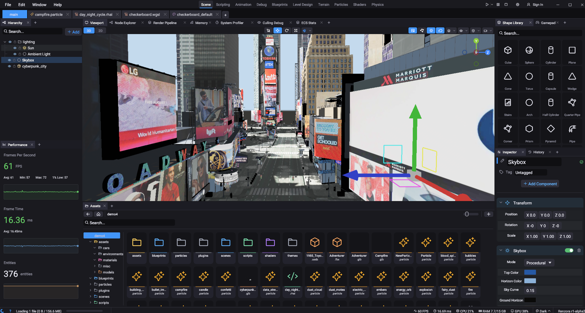

# Renzora Engine

A 3D game engine and visual editor built on [Bevy 0.18](https://bevyengine.org/).



> **Warning:** Early alpha. Expect bugs, incomplete features, and breaking changes between versions.

> **AI-Assisted Development:** This project uses AI code generation tools (Claude by Anthropic) throughout development. If that's a concern, check out [Bevy](https://bevyengine.org/), [Godot](https://godotengine.org/), or [Fyrox](https://fyrox.rs/).

## Getting Started

**Install Rust** from [rustup.rs](https://rustup.rs/), then:

```bash
cargo renzora       # build + run the editor
cargo runtime       # build + run the game runtime
cargo server        # build + run the dedicated server
```

Build only (no run):

```bash
cargo build-editor
cargo build-runtime
cargo build-server
cargo build-all     # everything including plugins
```

All commands use the `dist` profile. Don't use bare `cargo run` or `cargo build` -- these produce a different `bevy_dylib` hash and break plugin compatibility.

### Cross-Platform

```bash
cargo build-web         # WASM (WebGPU)
cargo build-android     # Android ARM64
cargo build-ios         # iOS ARM64
cargo build-tvos        # Apple TV
```

### Linux

Wayland dev libraries required: `sudo apt install libwayland-dev`

## Architecture

Three binaries share a common runtime library:

- **`src/editor.rs`** -- Editor. Calls `build_runtime_app()` then adds editor UI plugins.
- **`src/runtime.rs`** -- Shared runtime setup. Registers all core plugins.
- **`src/server.rs`** -- Dedicated server. Headless mode (no window, no rendering, no audio).

## Plugin SDK

Plugins are Rust `dylib` crates that get full Bevy ECS access -- `Commands`, `Query`, `Res`, `ResMut`, `Assets`, everything. No FFI wrappers or translation layers.

### Writing a Plugin

Add a dependency on the SDK crate and write a standard Bevy plugin:

```rust
use bevy::prelude::*;
use renzora::prelude::*;

#[derive(Default)]
pub struct MyPlugin;

impl Plugin for MyPlugin {
    fn build(&self, app: &mut App) {
        app.add_systems(Startup, setup);
    }
}

fn setup(mut commands: Commands) {
    commands.spawn(PointLight::default());
}

renzora::add!(MyPlugin);
```

### Plugin Cargo.toml

```toml
[package]
name = "my_plugin"
version = "0.1.0"
edition = "2021"

[lib]
crate-type = ["dylib"]

[dependencies]
bevy = { workspace = true }
renzora = { path = "../../crates/renzora" }
```

### Plugin Scope

Control when your plugin loads:

```rust
add!(MyPlugin);                // editor + exported games (default)
add!(MyPlugin, Editor);        // editor only
add!(MyPlugin, Runtime);       // exported games only
```

### Building Plugins

Plugins **must** be built as part of the workspace:

```bash
cargo build-all
```

Do **not** build plugins standalone from their own directory -- this produces a different `bevy_dylib` hash and the plugin won't load.

### Loading

The engine loads plugins from `<project>/plugins/` on startup (before `app.run()`). Restart the editor to pick up new plugins.

## Workspaces and Stable ABI

Rust does not have a stable ABI. This means two Rust binaries compiled separately cannot safely share types across a DLL boundary -- even if they use the same source code, different compilations can produce different memory layouts, vtable offsets, and `TypeId` values.

Renzora solves this by using a **Cargo workspace**. The engine and all plugins are members of the same workspace, and they all depend on `bevy` via `workspace = true`. When built together (with `cargo build-all`), Cargo compiles Bevy exactly once into `bevy_dylib.dll`, and both the engine and plugins link against that same shared library. This gives them identical type layouts and `TypeId`s, so `Res<Time>`, `Query<&Transform>`, etc. work across the DLL boundary as if everything were statically linked.

The catch: **plugins must be built with the same compiler, same Bevy version, and same build profile as the engine.** If any of these differ, the `TypeId`s won't match. The engine checks this at load time -- each plugin exports a `plugin_bevy_hash()` function that returns the `TypeId` of `bevy::ecs::world::World`, and the loader compares it against the engine's own hash. Mismatched plugins are rejected with a warning.

This is why all build commands use the `dist` profile. Using a different profile (like `dev`) produces different hashes, and plugins built with one profile won't load in an engine built with another.

## Exporting

The editor has an export overlay supporting Windows, Linux, macOS, Android, Fire TV, iOS, Apple TV, and Web (WASM).

Export templates are pre-built runtime binaries. Build them with:

```bash
cargo make dist-runtime           # desktop
cargo make dist-server            # dedicated server
cargo make dist-android-arm64     # Android
cargo make dist-web-runtime       # Web (WASM)
cargo make dist-ios               # iOS (macOS only)
```

The export pipeline scans your project for referenced assets, strips editor-only components, optimizes meshes, compresses everything into an `.rpak`, and bundles it with the template binary.

## Cargo Features

| Feature | Description | Default |
|---------|-------------|---------|
| `editor` | Full editor UI | Yes |
| `dynamic` | Dynamic linking (faster dev builds) | Yes |
| `native` | File watcher, gamepad, platform backends | Yes |
| `server` | Headless mode for dedicated servers | No |
| `solari` | Raytraced GI, DLSS, meshlet geometry (Vulkan + NVIDIA RTX) | No |

## Supported File Formats

| Format | Type |
|--------|------|
| `.glb` / `.gltf` / `.fbx` / `.obj` / `.stl` / `.ply` | 3D models |
| `.ron` | Scene files |
| `.rhai` / `.lua` | Scripts |
| `.blueprint` | Visual script graphs |
| `.material` | Material graphs |
| `.particle` | Particle effects |
| `.png` / `.jpg` / `.hdr` / `.exr` | Textures |
| `.ogg` / `.mp3` / `.wav` / `.flac` | Audio (native only) |
| `.rpak` | Compressed asset archives |

## License

Dual-licensed under MIT or Apache 2.0.

- [MIT License](LICENSE-MIT)
- [Apache License 2.0](LICENSE-APACHE)
